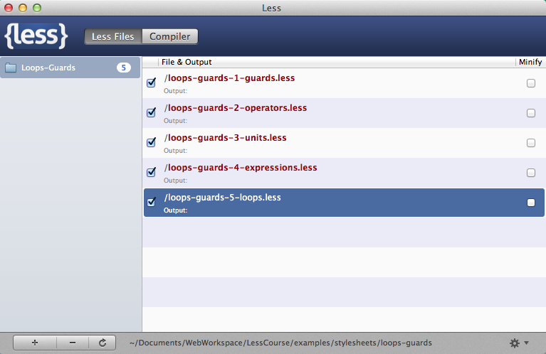
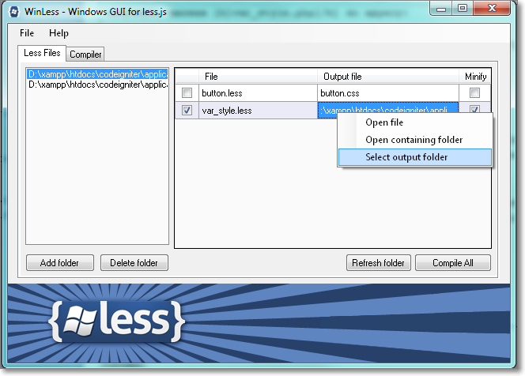
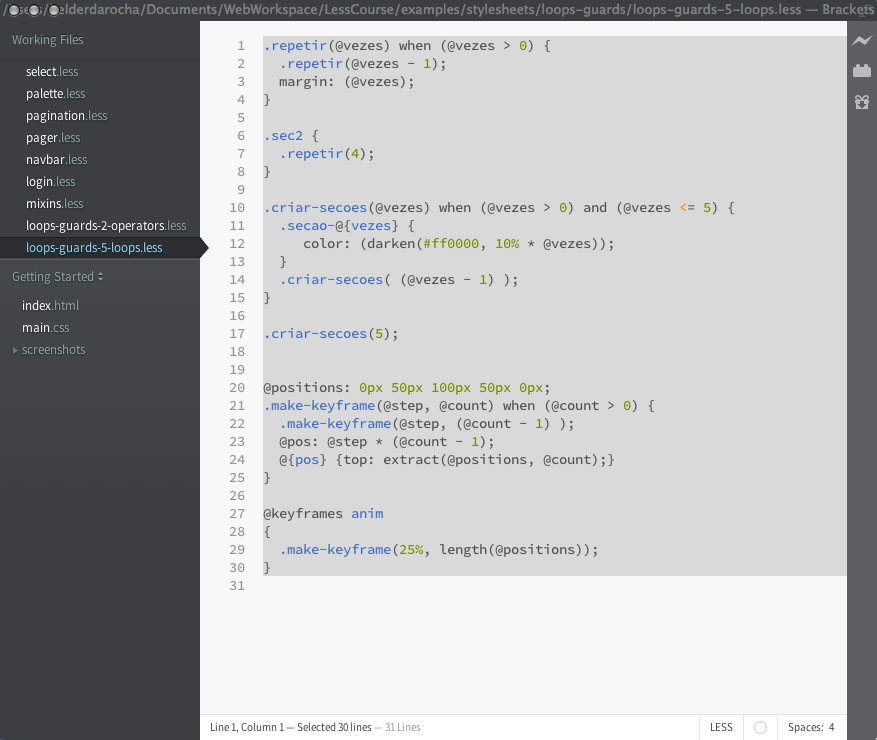
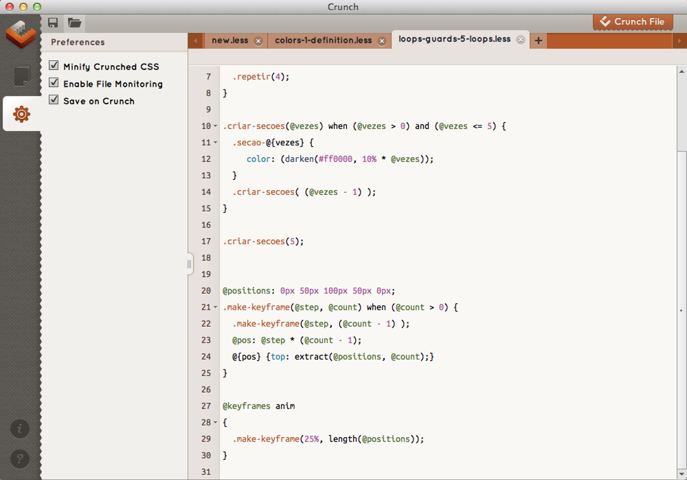
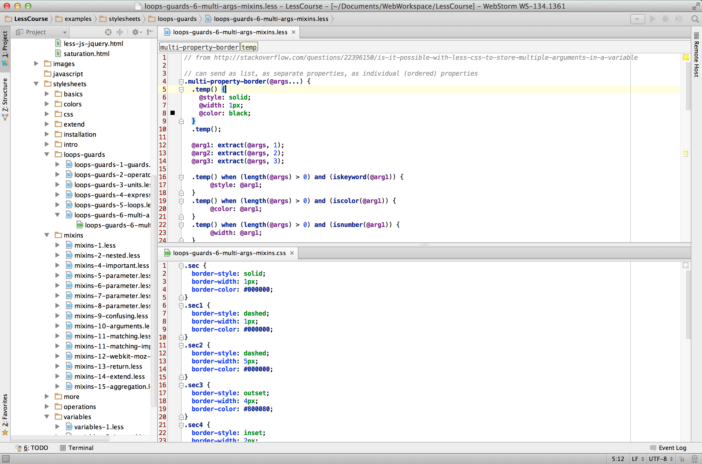
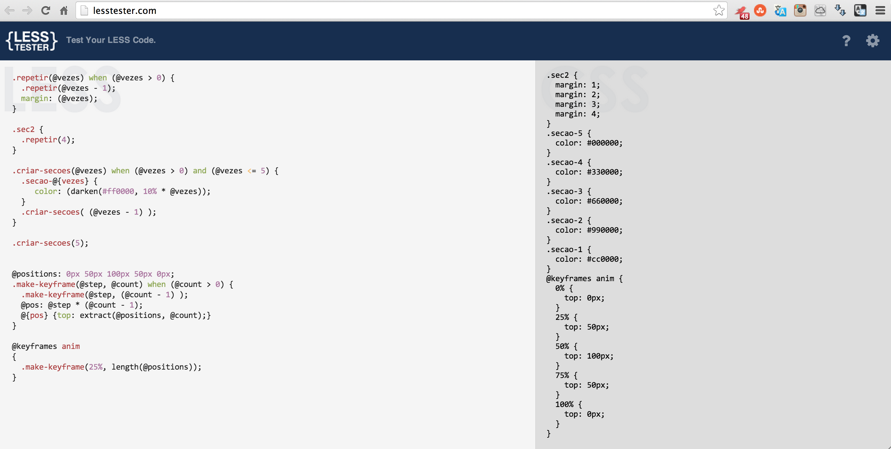

#{1: introdução }
##o que é less?
Less é um pré-processador CSS. Ele gera CSS. É também uma extensão do CSS: um documento CSS é um documento Less válido. Less acrescenta vários recursos que tornam mais eficientes a criação e manutenção de folhas de estilo do CSS. 

## por que usar less?
Less não é necessário, mas Less também não quebra os padrões existentes (não depende de suporte de browser) e torna o CSS mais fácil de manter.

Documentos Less são bem mais curtos que documentos CSS e geralmente têm muito menos repetição de código. Alguns dos recursos que Less acrescenta ao CSS incluem funções, variáveis, mixins, condicionais, escopo, aninhamento de blocos e outros recursos comuns em linguagens de programação. Less também facilita a criação de folhas de estilo independentes de browser e plataforma.

### variáveis
Less suporta constantes (que são chamadas de variáveis). Através delas é possível declarar um valor (ex: uma cor, url ou fonte) e reusar esse valor várias vezes na folha de estilos, evitando a repetição e facilitando a alteração. Por exemplo?

```
@cor-base: #f74020;
.sec1 {
    color: @cor-base;
    border-color: @cor-base;
}
```

### mixins
Com Less é possível utilizar uma coleção de propriedades declaradas para um seletor várias vezes, simplesmente incluindo o nome do seletor dentro de outro bloco. Esses seletores são chamados de mixins. Pode-se ainda criar mixins que recebem parâmetros, mixins que definem variáveis de retorno, mixins condicionais e mixins recursivos que funcionam como loops.

O primeiro seletor abaixo está sendo usado no segundo como um mixin.

```
.girar-90-graus {
   transform: rotate(90deg);
   -webkit-transform: rotate(90deg);
   -moz-transform: rotate(90deg);
   -o-transform: rotate(90deg);
   -ms-transform: rotate(90deg);
}

.titulo-lateral {
    font-weight: 900;
    .girar-90-graus; // as propriedades de .gerar-90-graus serão inseridas aqui
}
```

`//` representa um bloco de comentário em Less.

### aninhamento e escopo

Para aplicar um estilo em um elemento de acordo com seu contexto, CSS define uma sintaxe compacta:

```
.secao > div .item {
    color: blue;
}
```

Mas que causa repetição de código se também for necessário aplicar estilos nos outros elementos do contexto:

```
.secao > div {
    width: 560px;
}

.secao {
    position: absolute;
}
```

Less acrescenta uma segunda que evita a repetição de código em situações como esta, e também cria um escopo onde podem ser usadas variáveis locais. Os três blocos acima podem ser reduzidos a um só bloco com declarações aninhadas em Less:

 ```
 .secao {
     position: absolute;
     > div {
        width: 560px;
        .item {
           color: blue;
        }
    }
}
 ```

### extensão
Suponha que você tenha o seguinte CSS:

```
.secao1, .lateral {
   background: url(images/bg.svg);
   color: #f789a1;
}
.tabela td td > p {
    font-weight: bold;
    text-decoration: underline;
}
.secao2 {
    border: solid blue 1px;
}
```

Agora você necessita que um novo seletor `.secao2` tenha todos os estilos de `.lateral` e `.tabela td td > p` . Isto pode ser feito acrescentando `.secao2` nas outras duas declarações acima:

```
.secao2, .secao1, .lateral {
   background: url(images/bg.svg);
   color: #f789a1;
}
.secao2, .tabela td td > p {
    font-weight: bold;
    text-decoration: underline;
}
.secao2 {
    border: solid blue 1px;
}
```

Less faz isto automaticamente com o pseudo-seletor `:extend`, gerando o CSS acima:

```
.secao2:extend(.lateral, .tabela td td > p) {
    border: solid blue 1px;
}
```

### operadores e funções
Muitas vezes precisamos fazer contas em CSS para alterar posicionamentos e cores. Less facilita isto acrescentando ao CSS a possibilidade de se usar operações aritméticas, blocos condicionais, blocos de repetição, funções matemáticas e funções de manipulação de cores. Combinado com o uso de variáveis e mixins pode-se automatizar diversas tarefas repetitivas e evitar usar outras linguagens de programação para gerar cores e dimensões.

```
@largura-total: 1024px;
@largura-bloco: 960px;
@margem-esquerda: (@largura-total - @largura-bloco) / 2;
@cor-base: #800080;
.secao3 {
  left: @margem-esquerda;
  background: darken(@cor-base + #008000, 20%); // soma inverso e escurece
  color: spin(@cor-base, 180deg); // inverte a cor
}
```

O código acima gera o seguinte CSS:

```
.secao3 {
  left: 32px;
  background: #4d4d4d;
  color: #008000;
}
```

##como usar
O desenvolvimento com Less possui duas etapas:

1. Criação do arquivo `.less`
2. Compilação do arquivo `.less` (geração de um arquivo CSS)

Normalmente Less é usado apenas em desenvolvimento. É possível carregar um documento `.less` diretamente no browser que irá gerar um CSS durante a carga da página, porém isto é ineficiente e pode fazer com que a renderização da página demore.

O documento Less pode ser criado em qualquer editor de textos. Várias ferramentas de desenvolvimento Web populares suportam Less ou de forma nativa ou via plugin. Elas fazem a geração do CSS automaticamente. 

Less é CSS, então para criar um documento .less pode-se simplesmente usar um documento CSS e mudar a sua extensão para .less. Para compilar há várias opções:

1. Compilador lessc (linha de comando)
2. Compiladores automáticos (lessc com opção --watch, compiladores gráficos, plugins)

## compilação
### linha de comando

Em sistemas Windows, Mac ou Linux, o Less é instalado como aplicação JavaScript (Node.js) através do *Node Package Manager* (NPM). Se o Less estiver instalado no seu sistema, abra uma janela do terminal de comandos e digite:

```
lessc -version
```

Na tela será impressa a versão do Less que está instalada no seu sistema. Este tutorial assume que você está usando pelo menos a versão 1.7.

Para gerar um arquivo CSS a partir de um documento Less, a sintaxe é:

```
lessc arquivo.less > arquivo.css
```

O compilador lessc possui várias opções documentadas no site oficial do Less em lesscss.org. Uma das opções permite configurar a aplicação para monitorar documentos .less ou pastas, e gerar o .css automaticamente a cada alteração.

### ferramentas gráficas

Se você não se sente muito à vontade usando o terminal, existe a opção de utilizar um compilador gráfico como o *less.app* para *Mac OS* ou o *winless* para Windows. Eles permitem que se adicione arquivos que serão compilados e recompilados em CSS sempre que forem alterados, e não precisam executar comandos no terminal.

O less.app para MacOS permite associar uma pasta ou documentos individuais que serão monitorados A cada alteração eles serão compilados. Pode-se configurar o diretório onde os documentos CSS resultantes da compilação serão guardados.



O WinLess é similar ao less.app para sistemas Windows.



## ambientes de desenvolvimento
Você pode integrar o Less ao seu ambiente de desenvolvimento. No site oficial lesscss.org há uma lista de IDEs e ferramentas de Web Design que suportam Less, e vários outros que têm plugins que fazem a compilação automática.

Um editor popular que tem suporte a Less é o Adobe Brackets, que é gratuito:



O Crunch é um ferramenta completa que permite criar e editar documentos Less e também realiza a geração automática e compressão de CSS:



Um ambiente integrado pode ser mais produtivo por ter recursos como busca e substituição, edição de HTML, depuração de JavaScript, que muitas vezes fazem parte de aplicações que usam Less. Abaixo o JetBrains WebStorm com código Less em uma janela superior, e código CSS sendo gerado em uma janela inferior.



Finalmente, se você precisa de uma ferramenta accessível de qualquer lugar pode usar o site lesstester.com, onde você pode colar o conteúdo de um arquivo .less e obter o resultado da compilação em CSS.



### teste do ambiente
Escolha o seu ambiente de desenvolvimento preferido, e teste a instalação criando o arquivo de testes abaixo:

```
@cor-principal: #FF8800;

#secao {
   color: @cor-principal;
   border-color: @cor-principal;
   background: lighten(@cor-principal, 50%);
   a:hover {
   	  color: darken(@cor-principal, 30%);
   }
}
```

Grave o arquivo em uma pasta e use uma das ferramentas listadas acima para gerar o CSS. O resultado deve ser semelhante ao CSS abaixo:

```
#secao {
  color: #ff8800;
  border-color: #ff8800;
  background: #ffffff;
}
#secao a:hover {
  color: #663600;
}
```

##compilação em tempo real
O programa `lessc` que executamos e as ferramentas listadas acima são pré-processadores estáticos. Isto quer dizer que eles compilam o Less gerando um arquivo CSS estático que deve ser carregado em suas páginas Web.  

Você também pode usar folhas de estilo Less diretamente no HTML para processamento no browser. Como já foi mencionado, essa alternativa é lenta e ineficiente para uso em produção, mas pode ser útil em desenvolvimento.

Para usar Less no browser, é preciso carregar o script `less.js`, que pode ser baixado de <https://github.com/less>:

```
 <script src="less.js" type="text/javascript"></script>
```

Pode-se também usar o `less.js` disponível em um repositório de código na nuvem (CDN):

```
 <script src="http://cdnjs.cloudflare.com/ajax/libs/less.js/1.7.0/less.min.js"></script>
```

Agora pode-se incluir folhas de estilos Less diretamente usando:

```
 <link rel="stylesheet/less" type="text/css" href="teste.less" />
```

Mas é importante que as folhas de estilo Less sejam carregadas **antes** do script. 

Pode-se carregar vários documentos Less. Cada um será compilado individualmente, portanto não é possível compartilhar variáveis e outros recursos do Less entre elas. O CSS resultante seguirá as mesmas regras de cascade, na ordem em que os estilos Less foram declarados.

## versões e alternativas
Este curso foi preparado e testado com a versão 1.7 do Less. O Less não tem uma especificação formal e toda a documentação está disponível no site e no GitHub do projeto. Muitos detalhes da linguagem não estão documentados. Se você estiver usando uma versão anterior do Less, vários exemplos poderão não funcionar. Se estiver usando uma versão mais nova, alguns comandos poderão ser diferentes ou até mais simples.

SASS e Stylus são outros dois pré-processadores de CSS que têm objetivos semelhantes a Less. Ambos têm sintaxes que são extensões do CSS como o Less, mas também suportam sintaxes mais compactas, eliminando chaves e ponto-e-vírgula. SASS é o mais popular dos dois e a sua sintaxe compatível com CSS (SCSS) tem muitas semelhanças com Less.

## exercícios
1. Teste a sua instalação criando alguns arquivos CSS com extensão .less. Verifique o que acontece com o CSS gerado. Teste o uso de cores usando `rgb()` em vez de `#hhhhhh`.  A folha CSS gerada pelo Less pode ser diferente, mas é equivalente.
2. Use a folha de estilos .less criada no exercício 1 e carregue-a diretamente no browser usando `less.js`.
