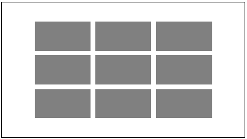

#{4: extend }
##:extend
`:extend` é uma pseudo-classe exclusiva do Less que copia o conjunto de regras do seletor no qual é aplicado aos conjuntos de regras de outros seletores passados como parâmetro. Evita que seletores sejam repetidos muitas vezes. 

Vejamos um exemplo simples. Considere a folha de estilos abaixo, em CSS puro:

```
.capitulo {
  font: 12pt;
  margin: 2px;
}

.secao1 {
  content: 'Secao 1';
}
```

Para que os estilos de `capitulo` tambem sejam aplicados em `.secao1`, usando CSS podemos estender o seletor `.secao1` com as regras de `capitulo` desta forma:
```
.capitulo, .secao1 {
  font: 12pt;
  margin: 2px;
}
```

A pseudo-classe `:extend` do Less oferece uma forma alternativa de obter esse resultado, incluíndo essa informação em um seletor que herda as declarações de estilo dos seletores passados como parâmetro. Em Less para obter o resultado acima pode-se fazer:

```
.secao1:extend(.capitulo) {
  content: 'Secao 1';
}
```
O resultado prático para a classe `.secao1` será:

```
.secao1 {
  content: 'Secao 1';
  font: 12pt;
  margin: 2px;
}
```
Mas a geração do CSS inteiro separará esse resultado em duas declarações, para evitar a repetição das regras de `.capitulo`:

```
.capitulo, .secao1 {
  font: 12pt;
  margin: 2px;
}
.secao1 {
  content: 'Secao 1';
}

```

## extensão múltipla

`:extend` pode ser aplicada a vários seletores, e incluirá regras de todos eles. No seguinte exemplo `secao1`, `secao2` e `livro2` tem um conjunto de regras vazio. O seletor `secao1` sera estendido com as mesmas regras de `.capitulo`, `secao2` será estendido com as regras que foram definidas para `secao1` mais as de `.capitulo`. `livro` terá a combinação das regras de `div` e `header`:

```
div, .capitulo, #copy {
  font: 12pt;
  margin: 2px;
}

.prefacio, header {
  color: #111;
  background: #eee;
}

.livro {
  padding: 2px;
}

.secao1:extend(.capitulo) {}
.secao2:extend(.secao1, .capitulo) {}
.livro:extend(div, header) {}
```

A regra de extensão aplicada a `secao2` também pode ser escrita como:

```
.secao2:extend(.secao1):extend(.capitulo) {}
```

Ainda haverá muita repetição se for necessário aplicar a mesma regra de extensão a vários seletores:

```
.secao1:extend(.capitulo, .prefacio), 
.secao2:extend(.capitulo, .prefacio), 
.secao3:extend(.capitulo, .prefacio) {}
```
Less resolve esse problema usando o símbolo `&`, que representa o conjunto dos seletores acumulados no bloco externo. Assim é possível aplicar a mesma regra de extensão a vários seletores usando um único `:extend`, obtendo o mesmo resultado do bloco acima: 

```
.secao1, .secao2, .secao3 {
  &:extend(.capitulo, .prefacio);
}
```
O bloco acima também pode ser escrito da forma abaixo: 

```
.secao1, .secao2, .secao3 {
  &:extend(.prefacio);
  &:extend(.capitulo);
}
```
Que tem como resultado em CSS:

```
.capitulo, .secao1, .secao2, .secao3 {
  font: 12pt;
  margin: 2px;
}
.prefacio, .secao1, .secao2, .secao3 {
  color: #111;
  background: #eee;
}
```

## extensão com seletores aninhados
Mais um exemplo com `:extend` usando seletores contextuais e aninhamento. O código abaixo:

```
s1 d1, s2 {
   &:extend(s3, s4 d2)
}
```

Pode também ser escrito como:

```
s1 d1:extend(s3, s4 d2), s2:extend(s3, s4 d2) {}
```

ou:

```
s1 d1:extend(s3):extend(s4 d2), s2:extend(s3):extend(s4 d2) {}
```

ou ainda:

```
s1 d1:extend(s3) {}
s1 d1:extend(s4 d2) {}
s2:extend(s3) {}
s2:extend(s4 d2) {}
```

Supondo que também existam as seguintes declarações, nas quais aparecem os seletores `s3` e `s4 d2` (observe que o contexto `s4 d2` revela-se no aninhamento):

```
t1, t3, s3, t4 {color: blue}
n1, s4 {
  content: 'nothing';
  d2 {
    font-size: 12pt
  }
}
```

O CSS resultante será

```
t1, t3, s3, t4, s1 d1, s2 {
  color: #0000ff;
}
n1 d2, s4 d2, s1 d1, s2 {
  font-size: 12pt;
}
n1, s4 {
  content: 'nothing';
}
```

Os blocos vazios, se não tiverem propriedades, são removidos.

## sobreposição de propriedades

`:extend` não impede a criação de propriedades duplicadas. Elas podem ocorrer no mesmo bloco ou em blocos diferentes aplicadas ao mesmo seletor. As regras sobre qual terá precedência são as mesmas do CSS: dentro de um mesmo bloco, se houver duas declarações afetando a mesma propriedade, vale a que foi definida por último; dentro do mesmo documento, propriedades aplicadas a seletores idênticos em blocos diferentes, também vale a última.

No exemplo abaixo o seletor `.n7` tem `background: orange`, mas também tem dois `:extend` que irão fazer com que o seletor `.n7` seja repetido nos blocos `.n1` e .`n2`. Não faz diferença a ordem em que os `&:extend` aparecem no primeiro bloco, mas a posição dos blocos `.n2` e `.n1`. `&:extend(.n2)` foi chamado depois de `&:extend(.n1)`, mas no documento, o bloco em que aparece `.n1` é o último.

```
.n7 {
  &:extend(.n1);
  background: orange;
  &:extend(.n2);
}

.n2 {
  background: green;
}

.n1 {
  color: yellow;
  background: red;
}
```

`.n7` será estendido com o conteúdo de `.n1` e `.n2` da seguinte forma no CSS gerado:

```
.n7 {
  background: orange;
}
.n2, .n7 {
  background: green;
}
.n1, .n7 {
  color: yellow;
  background: red;
}
```
Como todos os três blocos definem a propriedade background para o mesmo seletor `.n7`, apenas a última definição será preservada, e `.n7` terá a propriedade `background: red`.

Less também não impede ou detecta duplicação se seletores forem estendidos múltiplas vezes. No terceiro bloco abaixo, `.mast-head` estende `.head `e `.title`, mas como `.head` já estendia `.title`, `.mast-head` será copiado duas vezes:

```
.title {
  color: black;
}

.head {
  &:extend(.title);
}

.mast-head:extend(.head, .title) {}
```

Este é o resultado:

```
.title, .head, .mast-head, .mast-head {
  color: black;
}
```

Isto não altera o funcionamento do CSS, embora seja uma duplicação desnecessária. 

## pseudo-elementos e variáveis

Um seletor pode ter outras pseudo-classes além de extend, mas `:extend` tem sempre que ser a última:

```
pre:nth-child(odd):extend(div span) {}  // OK!
a:hover:extend(div):extend(section) {} // OK!
a:extend(div):hover {} // ILEGAL - causa erro no processador!
```

`:extend` pode ser anexado a um seletor representado por uma variável interpolada:

```
@var: .secao;
@{var}:extend(div) {}
```
Mas `:extend` não suporta (até o Less 1.6) variáveis como argumentos. Elas são ignoradas já que o processador não consegue achar o seletor representado pela variável. Não é mostrada mensagem de erro e a falha ocorre silenciosamente.

```
@var: .secao;
div:extend(@{var}) {} // ISTO NAO FUNCIONA!
```

## correspondência exata
Para aplicar as extensões, `:extend` precisa localizar seletores que combinem com os que foram passados como argumentos. Por default, essa correspondência precisa ser *exata*. A forma importa. Dois seletores diferentes que têm o mesmo efeito ou significado em CSS, como por exemplo `p:before:hover` e `p:hover:before` *não são considerados iguais* para `:extend`. A única exceção é conteúdo entre aspas em predicados: `[nome=abc]`, `[nome='abc']` e `[nome="abc"]` são considerados equivalentes.

Tipos de expressões com seletores que são equivalentes em CSS mas não são consideradas correspondências equivalentes em parâmetros de `:extend` incluem:

- Seletores equivalentes que usam ou omitem o seletor universal: `*.classe` e `.classe`, `*:before` e `:before` ou [`nome=abc]` e `*[nome=abc]`

- Seletores com pseudo-elementos equivalentes com ordem diferente: `a:before:hover` e `a:hover:before`

- Seletores do tipo `nth-` equivalentes com argumentos expressos de forma textualmente diferente: `a:nth-child(n+1)`, `a:nth-child(1n+1)`, `a:nth-child(odd)` e` a:nth-child(n + 1)`

Mesmo tendo usando como argumento quatro seletores equivalentes, `div` não será estendido nos blocos abaixos:

```
a:before:hover, p:nth-child(n + 1), *.secao, *[nome]
{
  text-decoration: underline;
}

div:extend(a:hover:before, p:nth-child(n+1), .secao, [nome]) {color: purple;}
```

e o resultado será:

```
a:before:hover, p:nth-child(n + 1), *.secao, *[nome] {
  text-decoration: underline;
}
div {
  color: purple;
}
```

Mas se for adicionado um espaço antes e outro depois do ` + `, a combinação exata de `p:nth-child(n + 1)` será suficiente para fazer `div` aparecer no primeiro bloco:

```
a:before:hover,
p:nth-child(n+1),
*.secao,
*[nome],
div {
  text-decoration: underline;
}
div {
  color: purple;
}
```

## correspondência parcial
Se um seletor do tipo `.a` for usado como argumento de `:extend`, ele encontrará correspondência apenas com seletores idênticos `.a`. Seletores `c.a` ou `.a.b` não serão considerados equivalentes. O seletor .new-section não será estendido pois .sec não tem correspondência exata com nenhum dos seletores do primeiro bloco:

```
div.sec, .sec.subsec, .sec:before {
  color: pink;
}

.new-section:extend(.sec) {}
```
Resultado:

```
div.sec, .sec.subsec, .sec:before {
  color: pink;
}
```

Mas Less irá aceitar essas correspondências se o argumento de `:extend` vier seguido da palavra `all`:

```
.new-section:extend(.sec all) {}
```
Assim ele vai gerar o CSS abaixo:

```
div.sec, .sec.subsec, .sec:before,
div.new-section, .new-section.subsec, .new-section:before {
  color: pink;
}
```

## escopo
O escopo de `:extend` vale para toda a página e blocos aninhados. Se for usado dentro de um bloco `@media`, ele só poderá estender seletores declarados dentro do mesmo bloco ou em blocos aninhados.

O seletor `body:extend(.page)` irá estender `body` em todos os blocos abaixo, mas `div:extend(.page)` usado dentro do primeiro bloco `@media` irá estender `div` apenas no bloco `.page` contido no mesmo bloco `@media`: 

```
.page {
  font-size: 20px;
  width: 100%;
  height: 100%;
}
@media (min-width: 48rem) {
  .page {
    font-size: 18px;
  }
  div:extend(.page) {}
}

@media print {
  .page {
    font-size: 12px;
  }
}

body:extend(.page) {};
```
Resultado em CSS:

```
.page, body {
  font-size: 20px;
  width: 100%;
  height: 100%;
}
@media (min-width: 48rem) {
  .page, div, body {
    font-size: 18px;
  }
}
@media print {
  .page, body {
    font-size: 12px;
  }
}
```

## quando usar :extend
Com `:extend` pode-se evitar a criação de uma classe no HTML somente para aplicar propriedades gerais que devem ser usadas por um grupo de elementos.

Por exemplo, suponha que você tenha uma folha de estilos que defina um seletor para posicionamento *default* centralizado (`.abs`) e outro para construir retângulos 100x50 cinzas (`.box`) como mostrado abaixo.

```
.abs {
  position: absolute;
  top: 0; left: 0; bottom: 0; right: 0;
  margin: auto;
}
.box {
  background-color: gray;
  height: 50px;
  width: 100px;
}
```

Você tem 9 `div`s dentro de uma section e pretende renderizar cada `div` como um `.box` e posicionar da forma abaixo:



Então você pode utilizar a folha de estilos less abaixo:

```
@import url('abs-box.less');

@up: 50%;
@down: -@up;
@right: 50%;
@left: -@right;

section {
  width: 450px;
  height: 250px;
  border: solid black 1px;
  position: relative;
}

.top {
  top: @up;
}
.bottom {
  top: @down;
}
.left {
  left: @left;
}
.right {
  left: @right;
}
```

E aplicar as classes nos seus `div`s de acordo com a posição desejada para cada retângulo:

```
<section>
   <div class="box abs top left"></div>
   <div class="box abs top"></div>
   <div class="box abs top right"></div>
   <div class="box abs left" ></div>
   <div class="box abs"></div>
   <div class="box abs right"></div>
   <div class="box abs bottom left" ></div>
   <div class="box abs bottom"></div>
   <div class="box abs bottom right"></div>
</section>
```

Há muita repetição desnecessária. Se cada classe `.top`, `.right`, etc. sempre vai ser um `.box` e um `.abs`, podemos herdar os estilos desses seletores e evitar repetir `"box abs"` em cada classe.

Então acrescentamos o bloco seguinte, estendendo com as propriedades de `.box` e `.abs` os quatro seletores de posicionamento, e mais um com bloco vazio que simplesmente herda os estilos (`.center`):

```
.right, .top, .bottom, .left, .center
{
  &:extend(.abs, .box);
}
```

Com isto, não precisamos mais repetir as classes `.box` e `.abs` em cada `div`, mantendo apenas as classes de posicionamento e deixando o código mais limpo:

```
<section>
   <div class="top left"></div>
   <div class="top"></div>
   <div class="top right"></div>
   <div class="left" ></div>
   <div class="center"></div>
   <div class="right"></div>
   <div class="bottom left" ></div>
   <div class="bottom"></div>
   <div class="bottom right"></div>
</section>
```

##exercícios
1. x
2. y
3. z
4. a
5. b
6. c
